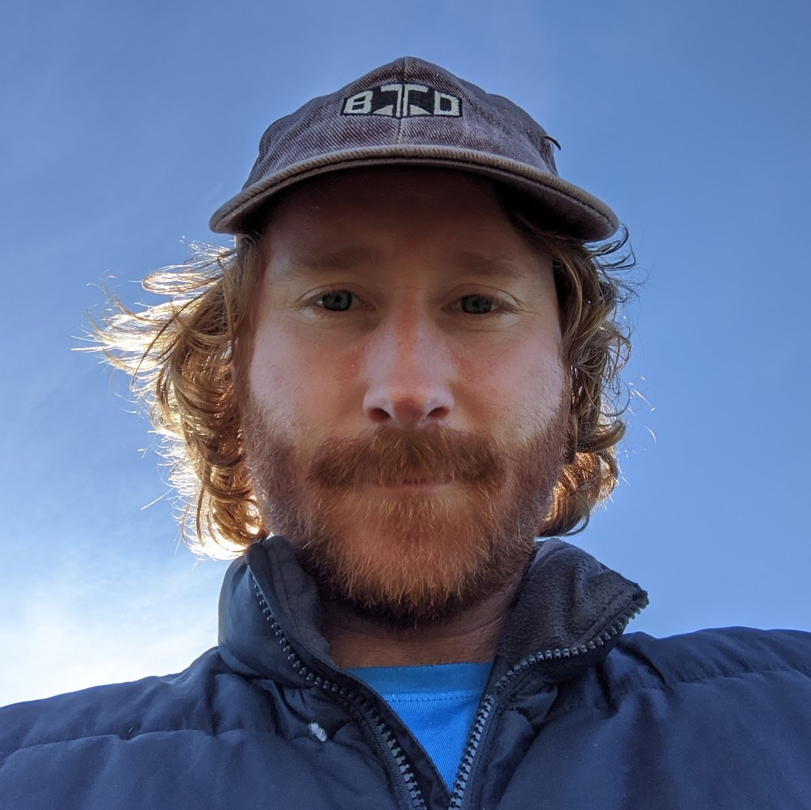

```{r setup, include=FALSE}
knitr::opts_chunk$set(echo = FALSE)
library(vitae)
```

## 


	


## 


<!--  { height=500px } -->

## {data-background="img/northbeach1.jpg"} 

## {data-background="img/northbeach_bre.jpg"}

## Education and Work Experience

- [personal/academic website](https://sebdalgarno.netlify.app)  

## Research
- [Freshwater Fish Ecology lab](https://www.ffishlab.ca/)  

- MITACS funding with BC Hydro 

- Using ~10 years of acoustic telemetry data and statistical models to make inferences about White Sturgeon movement in the Columbia River in relation to things like river flow and temperature. 

## Other (work-related) interests
- Open Source Software development (R packages)
- [Interactive data visualization and mapping](https://haidagwaiilogging.netlify.app/)
- web development
- [North Beach Consulting](https://northbeachconsulting.ca)  


## Miscellaneous
- [Fishy Data blog](https://fishydata.netlify.app) 
- [band](https://rustymouldandthesugaragates.bandcamp.com/)  


